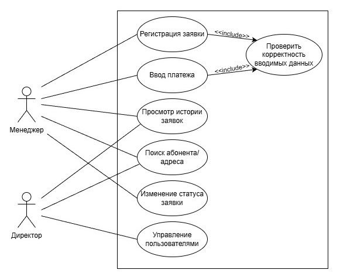

# Лабораторная работа №1
Тема: Формулирование требований к программной системе  
Цель работы: Научиться анализировать поставленную задачу, формулировать функциональные и нефункциональные требования к проектируемой системе  
Тема ВКР: Разработка программного модуля автоматизации операционных процессов домофонной компании в рамках CRM-системы

## Перечень заинтересованных лиц (стейкхолдеров)
1. Менеджер (Оператор)
    * Сотрудник, принимающий входящие звонки (заявки) от жильцов и работающий с CRM-системой в офисе.
2. Мастер (Техник)
    * Выездной специалист, осуществляющий ремонт и обслуживание домофонного оборудования.
3. Руководитель компании (Директор)
    * Лицо, принимающее управленческие решения.

## Перечень функциональных требований
Система должна предоставлять следующие возможности:  
**Блок «Абоненты и Договоры»:**  
1. Создание, редактирование и удаление карточки абонента (ФИО, телефон, лицевой счет).
2. Ведение реестра адресов (Улица, Дом, Подъезд, Квартира) с привязкой оборудования.
3. Отображение статуса договора (активен, расторгнут, должник).
   
**Блок «Заявки и Ремонт»:**  
  
5. Регистрация входящей заявки на неисправность (дата, тип неисправности, комментарий).  
6. Назначение ответственного мастера на заявку.  
7. Смена статуса заявки (Новая -> В работе -> Выполнена / Отменена).  
8. Просмотр истории заявок по конкретному адресу или абоненту.  
  
**Блок «Финансы»:**  
  
9. Начисление абонентской платы (массовое ежемесячное начисление).  
10. Ручной ввод платежей (при оплате в офисе) или импорт реестра платежей из банка.  
11. Отображение текущего баланса абонента.
  
**Блок «Системные функции»:**  
  
12. Аутентификация пользователей (логин/пароль) с разделением прав доступа (Менеджер, Админ).  
13. Импорт исторических данных из старой БД (Access).

## Диаграмма вариантов использования

## Перечесь сделанных предположений
1. Наличие интернета: Предполагается, что в офисе компании есть стабильное интернет-соединение.
2. Миграция данных: Предполагается, что данные из старой Access-базы технически возможно экспортировать в промежуточный формат (CSV/Excel) для загрузки в новую систему.
3. Оборудование: Серверная часть будет развернута либо на локальном сервере компании, либо на арендованном VDS/VPS (облаке).
4. Модель оплаты: Система не проводит транзакции сама, а только фиксирует факт оплаты (интеграция с банковским эквайрингом на данном этапе не требуется, только реестровый обмен или ручной ввод).

## Перечень нефункциональных требований
1. Производительность
    * Время отклика системы при поиске абонента по адресу или фамилии не должно превышать 1-2 секунды.
2. Надежность и целостность данных
    * Система должна обеспечивать транзакционность операций и ежедневное автоматическое резервное копирование.
    * Система должна обрабатывать типичные ошибки данных с выводом понятного сообщения, без прерывания своей работы или аварийного завершения выполнения.
3. Удобство сопровождения
    * Использование современного стека технологий и разделение на слои.
4. Безопасность
    * Хранение паролей в хешированном виде, разграничение прав доступа к персональным данным абонентов.
