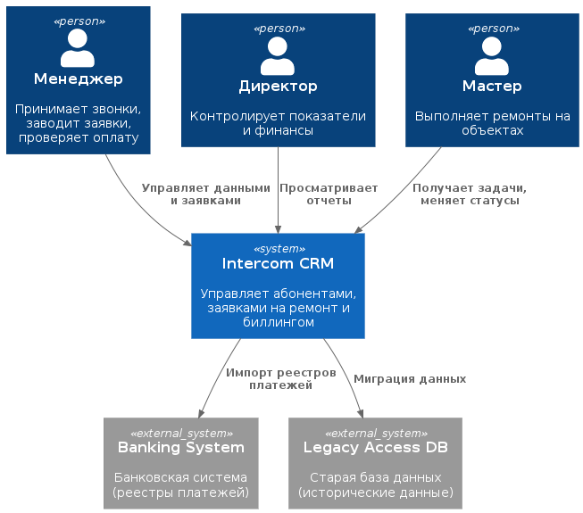
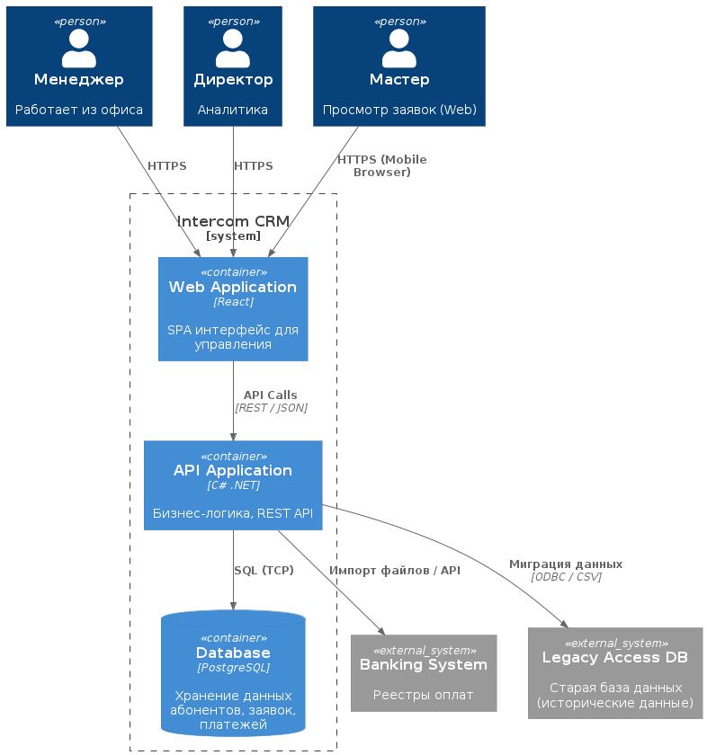
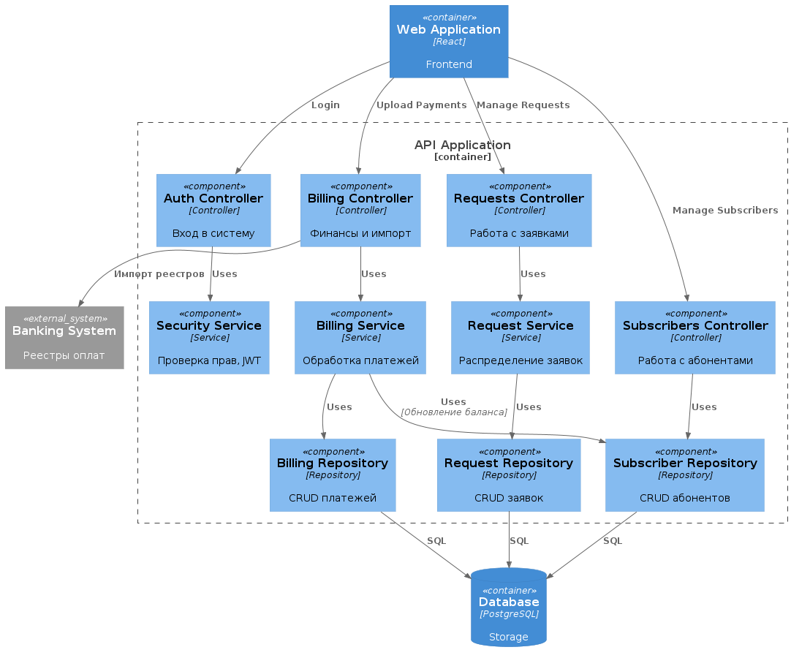

# Лабораторная работа №2

**Тема:** Использование нотации C4 model для проектирования архитектуры программной системы
**Цель работы:** Получить опыт использования графической нотации для фиксации архитектурных решений.

## Диаграмма системного контекста (System Context Diagram)

На этом уровне мы определяем границы CRM-системы и показываем, кто и как с ней взаимодействует, а также от каких внешних систем она зависит.

**Основные элементы диаграммы:**
*   **Сотрудники (Internal):**
    *   **Менеджер:** Основной пользователь, работает с заявками и абонентами.
    *   **Директор:** Просматривает отчеты и аналитику.
    *   **Мастер:** Получает задачи на ремонт и отчитывается об их выполнении.
*   **Intercom CRM (Разрабатываемая система):** Центральная информационная система компании.
*   **External Banking System:** Внешняя система (банк/эквайринг) или файловый обмен, откуда поступают реестры платежей жильцов.
*   **Legacy Data Source:** Старая база Access (используется временно для миграции исторических данных или параллельной сверки на этапе внедрения).



**Код диаграммы (PlantUML):**
```plantuml
@startuml
!include https://raw.githubusercontent.com/plantuml-stdlib/C4-PlantUML/master/C4_Context.puml

Person(disp, "Менеджер", "Принимает звонки, заводит заявки, проверяет оплату")
Person(admin, "Директор", "Контролирует показатели и финансы")
Person(tech, "Мастер", "Выполняет ремонты на объектах")

System(crm, "Intercom CRM", "Управляет абонентами, заявками на ремонт и биллингом")

System_Ext(bank, "Banking System", "Банковская система (реестры платежей)")
System_Ext(legacy, "Legacy Access DB", "Старая база данных (исторические данные)")

Rel(disp, crm, "Управляет данными и заявками")
Rel(admin, crm, "Просматривает отчеты")
Rel(tech, crm, "Получает задачи, меняет статусы")

Rel(crm, bank, "Импорт реестров платежей")
Rel(crm, legacy, "Миграция данных")
@enduml
```

---

## Диаграмма контейнеров (Container Diagram)

На этом уровне мы раскрываем архитектуру системы, показывая, из каких технических модулей она состоит.

**Основные элементы диаграммы:**
1.  **Web Application (SPA):** Единый фронтенд для всех пользователей (Менеджер, Директор, Мастер). Работает в браузере, не требует установки.
2.  **API Application (Backend):** Серверная часть. Реализует всю бизнес-логику, расчеты начислений и управление доступом.
3.  **Database:** Надежная реляционная СУБД (PostgreSQL) для замены Access.

**Обоснование выбора архитектурного стиля:**
Выбран стиль **N-Tier (Многозвенная архитектура)** с реализацией «Тонкий клиент - Веб-сервер - Сервер БД».
*   **Причина 1 (Надежность и Отказоустойчивость):** В отличие от текущего решения на Access, где ошибка на клиенте может повредить файл базы, здесь БД изолирована за API. Если у менеджера «зависнет» браузер, сервер продолжит работать.
*   **Причина 2 (Централизованное управление):** Обновление логики происходит только на сервере. Не нужно бегать по офису и обновлять скрипты на каждом компьютере, как это было с Access/QBasic.
*   **Причина 3 (Универсальность доступа):** Использование веб-интерфейса позволяет сотрудникам (в том числе мастерам) получать доступ к системе с любого устройства (ПК, планшет, смартфон) без разработки отдельных нативных приложений.



**Код диаграммы (PlantUML):**
```plantuml
@startuml
!include https://raw.githubusercontent.com/plantuml-stdlib/C4-PlantUML/master/C4_Container.puml

Person(disp, "Менеджер", "Работает из офиса")
Person(admin, "Директор", "Аналитика")
Person(tech, "Мастер", "Просмотр заявок (Web)")

System_Boundary(c1, "Intercom CRM") {
    Container(web_app, "Web Application", "React", "SPA интерфейс для управления")
    Container(api, "API Application", "C# .NET", "Бизнес-логика, REST API")
    ContainerDb(db, "Database", "PostgreSQL", "Хранение данных абонентов, заявок, платежей")
}

System_Ext(bank, "Banking System", "Реестры оплат")
System_Ext(legacy, "Legacy Access DB", "Старая база данных (исторические данные)")

Rel(disp, web_app, "HTTPS")
Rel(admin, web_app, "HTTPS")
Rel(tech, web_app, "HTTPS (Mobile Browser)")

Rel(web_app, api, "API Calls", "REST / JSON")

Rel(api, db, "SQL (TCP)")
Rel(api, bank, "Импорт файлов / API")
Rel(api, legacy, "Миграция данных", "ODBC / CSV")
@enduml
```

---

## Диаграмма компонентов (Component Diagram)

Детализируем ключевой контейнер системы — серверную часть, содержащую основную бизнес-логику.

### 1. Диаграмма компонентов для "API Application" (Backend)

Контейнер отвечает за обработку данных, миграцию с Access и биллинг. На диаграмме показано взаимодействие внутренних компонентов с базой данных и внешней банковской системой.

**Описание компонентов:**
*   **Requests Controller:** Обрабатывает HTTP-запросы, связанные с заявками на ремонт.
*   **Subscribers Controller:** Управление карточками абонентов.
*   **Billing Controller:** Точка входа для загрузки реестров платежей (интеграция с банком).
*   **Security Component:** Аутентификация и проверка прав.
*   **Request Service:** Логика назначения мастера и трекинг статусов.
*   **Billing Service:** Логика парсинга реестров, расчета сальдо и формирования квитанций.
*   **Data Access Layer (Repositories):** Слой абстракции для работы с БД (ORM).



**Код диаграммы (PlantUML):**
```plantuml
@startuml
!include https://raw.githubusercontent.com/plantuml-stdlib/C4-PlantUML/master/C4_Component.puml

Container(web, "Web Application", "React", "Frontend")
ContainerDb(db, "Database", "PostgreSQL", "Storage")
System_Ext(bank, "Banking System", "Реестры оплат")

Container_Boundary(api, "API Application") {
    Component(auth_ctrl, "Auth Controller", "Controller", "Вход в систему")
    Component(req_ctrl, "Requests Controller", "Controller", "Работа с заявками")
    Component(sub_ctrl, "Subscribers Controller", "Controller", "Работа с абонентами")
    Component(bill_ctrl, "Billing Controller", "Controller", "Финансы и импорт")

    Component(sec_serv, "Security Service", "Service", "Проверка прав, JWT")
    Component(req_serv, "Request Service", "Service", "Распределение заявок")
    Component(bill_serv, "Billing Service", "Service", "Обработка платежей")

    Component(repo_req, "Request Repository", "Repository", "CRUD заявок")
    Component(repo_sub, "Subscriber Repository", "Repository", "CRUD абонентов")
    Component(repo_bill, "Billing Repository", "Repository", "CRUD платежей")

    Rel(web, auth_ctrl, "Login")
    Rel(web, req_ctrl, "Manage Requests")
    Rel(web, sub_ctrl, "Manage Subscribers")
    Rel(web, bill_ctrl, "Upload Payments")
    
    Rel(auth_ctrl, sec_serv, "Uses")
    Rel(req_ctrl, req_serv, "Uses")
    Rel(bill_ctrl, bill_serv, "Uses")
    Rel(sub_ctrl, repo_sub, "Uses")

    Rel(bill_ctrl, bank, "Импорт реестров") 

    Rel(req_serv, repo_req, "Uses")
    Rel(bill_serv, repo_bill, "Uses")
    Rel(bill_serv, repo_sub, "Uses", "Обновление баланса")
}

Rel(repo_req, db, "SQL")
Rel(repo_sub, db, "SQL")
Rel(repo_bill, db, "SQL")
@enduml
```