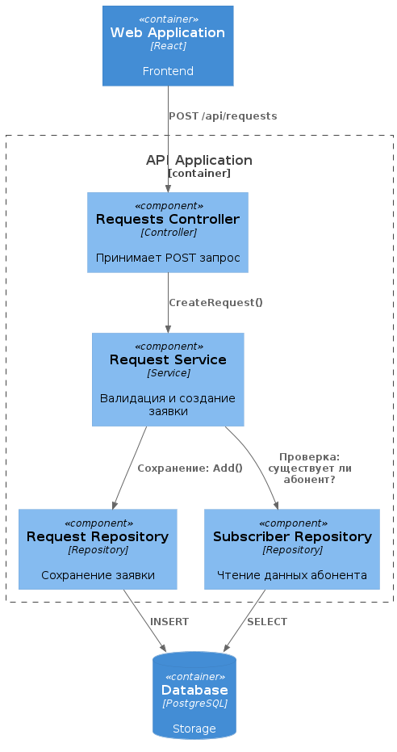
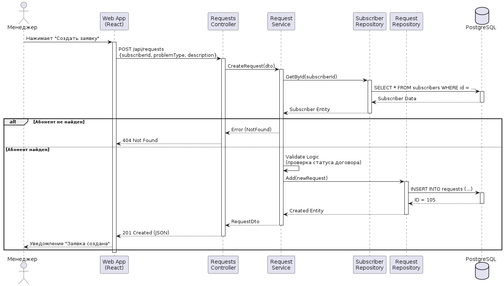
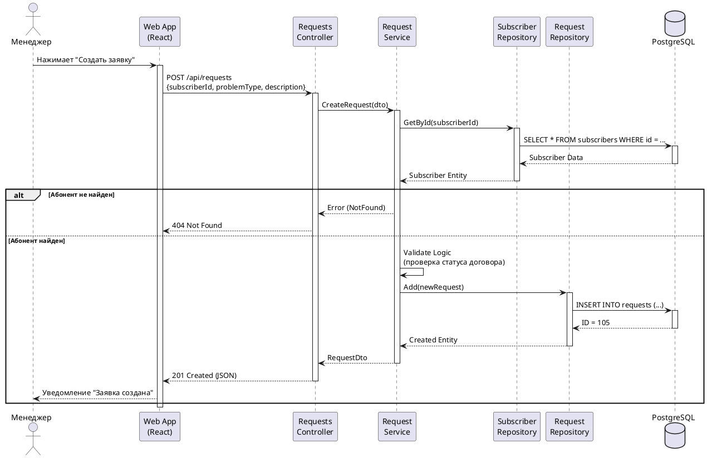
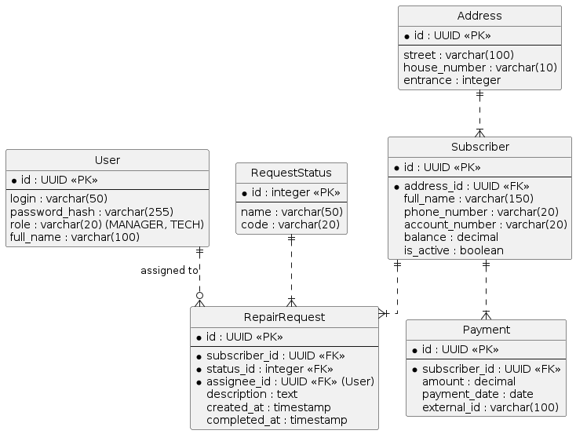

# Лабораторная работа №3
**Тема:** Использование принципов проектирования на уровне методов и классов  
**Цель работы:** Получить опыт проектирования и реализации модулей с использованием принципов KISS, YAGNI, DRY, SOLID и др.

---

## Диаграмма контейнеров

В качестве основы используется архитектура, разработанная в Лабораторной работе №2. Детализируемым контейнером является API Application (Backend).


**Код PlantUML взят из ЛР №2**
```plantuml
@startuml
!include https://raw.githubusercontent.com/plantuml-stdlib/C4-PlantUML/master/C4_Container.puml

Person(disp, "Менеджер", "Работает из офиса")
Person(admin, "Директор", "Аналитика")
Person(tech, "Мастер", "Просмотр заявок (Web)")

System_Boundary(c1, "Intercom CRM") {
    Container(web_app, "Web Application", "React", "SPA интерфейс для управления")
    Container(api, "API Application", "C# .NET", "Бизнес-логика, REST API")
    ContainerDb(db, "Database", "PostgreSQL", "Хранение данных абонентов, заявок, платежей")
}

System_Ext(bank, "Banking System", "Реестры оплат")
System_Ext(legacy, "Legacy Access DB", "Старая база данных (исторические данные)")

Rel(disp, web_app, "HTTPS")
Rel(admin, web_app, "HTTPS")
Rel(tech, web_app, "HTTPS (Mobile Browser)")

Rel(web_app, api, "API Calls", "REST / JSON")

Rel(api, db, "SQL (TCP)")
Rel(api, bank, "Импорт файлов / API")
Rel(api, legacy, "Миграция данных", "ODBC / CSV")
@enduml
```

---

## Диаграмма компонентов

Детализация контейнера API Application. Для демонстрации кода и взаимодействия выбран сценарий «Регистрация заявки на ремонт», в котором участвуют `Requests Controller`, `Request Service`, `Request Repository`, `Subscriber Repository` и `Database`.



**Код диаграммы (PlantUML):**
```plantuml
@startuml
!include https://raw.githubusercontent.com/plantuml-stdlib/C4-PlantUML/master/C4_Component.puml

Container(web, "Web Application", "React", "Frontend")
ContainerDb(db, "Database", "PostgreSQL", "Storage")

Container_Boundary(api, "API Application") {
    Component(req_ctrl, "Requests Controller", "Controller", "Принимает POST запрос")
    Component(req_serv, "Request Service", "Service", "Валидация и создание заявки")
    
    Component(repo_req, "Request Repository", "Repository", "Сохранение заявки")
    Component(repo_sub, "Subscriber Repository", "Repository", "Чтение данных абонента")

    ' Основной поток
    Rel(web, req_ctrl, "POST /api/requests")
    Rel(req_ctrl, req_serv, "CreateRequest()")
    
    ' Логика сервиса
    Rel(req_serv, repo_sub, "Проверка: существует ли абонент?")
    Rel(req_serv, repo_req, "Сохранение: Add()")
}

' Работа с БД
Rel(repo_req, db, "INSERT")
Rel(repo_sub, db, "SELECT")
@enduml
```

---

## Диаграмма последовательностей

Диаграмма иллюстрирует процесс **создания новой заявки на ремонт** менеджером.
Показывает прохождение потока управления от Web-интерфейса через слои API до Базы Данных.

**Логика взаимодействия:**
1.  Менеджер отправляет форму с веб-страницы.
2.  Контроллер принимает HTTP-запрос, валидирует входные данные (DTO).
3.  Сервис проверяет бизнес-правила (существует ли такой абонент, нет ли у него долгов, блокирующих ремонт).
4.  Если все ок - сервис вызывает репозиторий для сохранения.
5.  Репозиторий выполняет SQL-запрос.





---

## Модель БД

Диаграмма классов UML, описывающая схему базы данных PostgreSQL.
Минимально необходимое количество сущностей для работы модуля CRM:

1.  **Subscriber (Абонент):** Основная сущность.
2.  **Address (Адрес):** Вынесена отдельно для нормализации (один дом - много абонентов).
3.  **RepairRequest (Заявка):** Сущность, создаваемая в рассматриваемом кейсе.
4.  **RequestStatus (Справочник статусов):** Новая, В работе, Выполнена.
5.  **User (Пользователь системы):** Менеджер или Мастер.
6.  **Payment (Платеж):** История оплат (для проверки баланса).



---

## Применение основных принципов разработки

Реализация серверной части на C# (.NET Core).

### 1. Принцип SOLID
Используется разделение ответственности: Контроллер обрабатывает HTTP, Сервис - бизнес-логику, Репозиторий - данные.

**Пример (SRP - Single Responsibility & DIP - Dependency Inversion):**
```csharp
// Интерфейс для инверсии зависимости (DIP)
public interface IRequestService 
{
    Task<RequestDto> CreateRequestAsync(CreateRequestDto dto);
}

// Контроллер отвечает ТОЛЬКО за прием запроса и возврат ответа (SRP)
[ApiController]
[Route("api/requests")]
public class RequestsController : ControllerBase
{
    private readonly IRequestService _service; // Зависимость от абстракции (DIP)

    public RequestsController(IRequestService service)
    {
        _service = service;
    }

    [HttpPost]
    public async Task<IActionResult> Create(CreateRequestDto dto)
    {
        if (!ModelState.IsValid) return BadRequest(ModelState); // Валидация входных данных
        
        try {
            var result = await _service.CreateRequestAsync(dto);
            return CreatedAtAction(nameof(GetById), new { id = result.Id }, result);
        }
        catch (NotFoundException ex) {
            return NotFound(ex.Message);
        }
    }
}
```

### 2. Принцип DRY (Don't Repeat Yourself)
Вместо дублирования логики маппинга (перевода Entity в DTO) в каждом методе, выносим это в отдельный метод расширения или используем AutoMapper.

**Пример:**
```csharp
// Плохой вариант (нарушение DRY):
// В методе Get: return new RequestDto { Id = r.Id, Descr = r.Description ... };
// В методе Create: return new RequestDto { Id = r.Id, Descr = r.Description ... };

// Хороший вариант (DRY):
public static class RequestExtensions 
{
    public static RequestDto ToDto(this RepairRequest entity)
    {
        return new RequestDto 
        {
            Id = entity.Id,
            Description = entity.Description,
            Status = entity.Status.Name,
            CreatedAt = entity.CreatedAt
        };
    }
}
// Использование: return requestEntity.ToDto();
```

### 3. Принцип KISS (Keep It Simple, Stupid)
Код должен быть максимально простым. В сервисе мы не пишем сложную фабрику заявок, если достаточно простого конструктора.

**Пример:**
```csharp
public async Task<RequestDto> CreateRequestAsync(CreateRequestDto dto)
{
    var subscriber = await _subRepo.GetByIdAsync(dto.SubscriberId);
    if (subscriber == null) 
        throw new NotFoundException("Абонент не найден");

    // KISS: Создание объекта явным образом
    var request = new RepairRequest 
    {
        SubscriberId = dto.SubscriberId,
        Description = dto.Description,
        CreatedAt = DateTime.UtcNow,
        StatusId = (int)Statuses.New
    };

    await _reqRepo.AddAsync(request);
    await _unitOfWork.SaveChangesAsync();

    return request.ToDto();
}
```

### 4. Принцип YAGNI (You Aren't Gonna Need It)
Мы реализуем только то, что нужно сейчас.
*   *Пример:* В ТЗ сказано «создавать заявки».
*   *Нарушение YAGNI:* Сразу писать механизм «экспорта заявок в XML для интеграции с 1С», которого нет в требованиях, но «вдруг пригодится».
*   *Соблюдение YAGNI:* Реализуем только метод `CreateRequest` и `GetRequests`. Экспорт не пишем.

---

## Дополнительные принципы разработки

### 1. BDUF (Big Design Up Front - Масштабное проектирование прежде всего)
*   **Решение:** **Отказываемся**.
*   **Обоснование:** В современных условиях требования бизнеса меняются быстро. Полное детальное проектирование всей системы до написания первой строчки кода (как в «Водопаде») приведет к тому, что к моменту релиза проект устареет. Для ВКР используется итеративный подход: сначала делаем ядро (замену Access), затем добавляем фичи. Мы проектируем архитектуру (C4), но детали реализации уточняем в процессе.

### 2. SoC (Separation of Concerns - Разделение ответственности)
*   **Решение:** **Применяем**.
*   **Обоснование:** Это фундаментальный принцип для борьбы с усложнением.
    *   *На уровне архитектуры:* Frontend отделен от Backend (Web App vs API). Это позволяет менять интерфейс, не ломая логику.
    *   *На уровне кода:* Логика валидации платежей отделена от логики назначения мастеров. Это упрощает тестирование и поддержку, в отличие от старого Access, где формы и данные были смешаны в кучу.

### 3. MVP (Minimum Viable Product - Минимально жизнеспособный продукт)
*   **Решение:** **Применяем**.
*   **Обоснование:**
    *   *Цель:* Как можно быстрее пересадить диспетчеров с нестабильного работающего Access на стабильный Web.
    *   *Состав MVP:* Только база абонентов, прием заявок и простой ввод оплат.
    *   *Что отложено (не входит в MVP):* Интеграция с онлайн-кассами. Это позволяет сократить срок разработки и быстрее получить обратную связь.

### 4. PoC (Proof of Concept - Доказательство концепции)
*   **Решение:** **Частичное применение**.
*   **Обоснование:** PoC необходим только для самых рискованных частей. В данном проекте PoC был нужен на этапе **миграции данных**: нужно было написать маленький скрипт, чтобы доказать, что мы технически можем вытащить данные из `.mdb` файла Access 2003 года и корректно переложить их в PostgreSQL с сохранением кодировки (кириллицы). Для остальных частей (CRUD операции) PoC не нужен, так как технологии (.NET + React) стандартны.