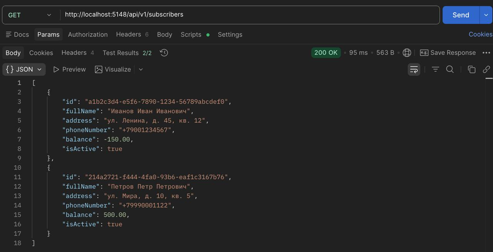
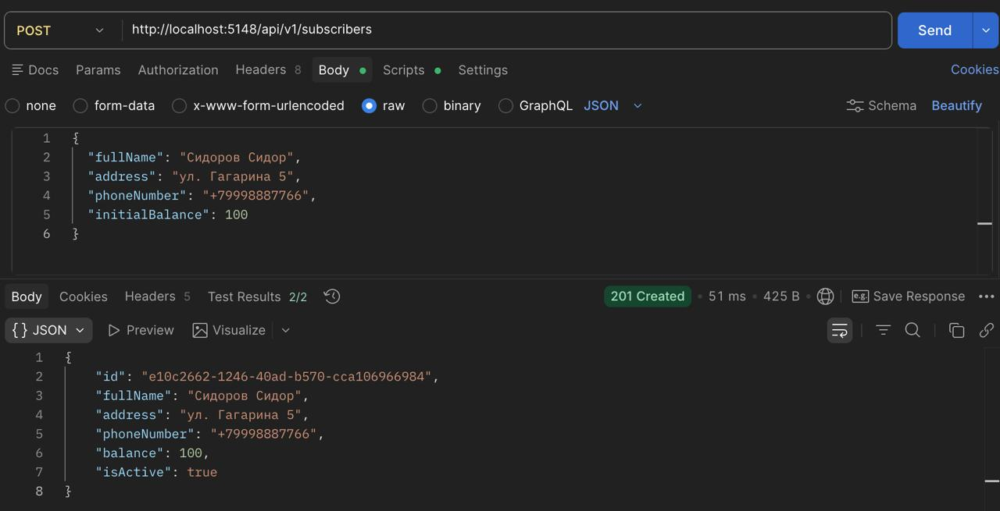
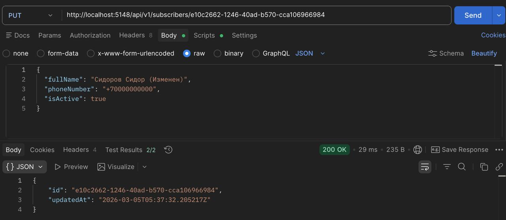
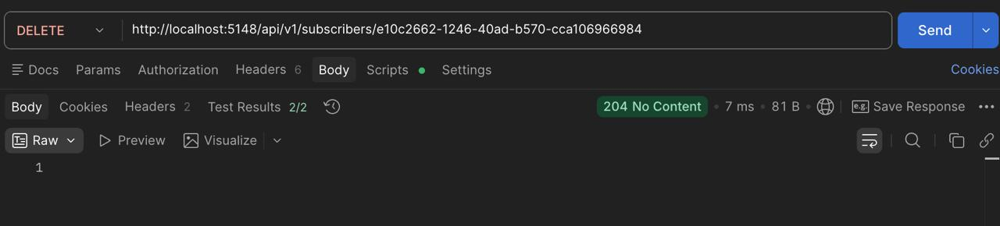
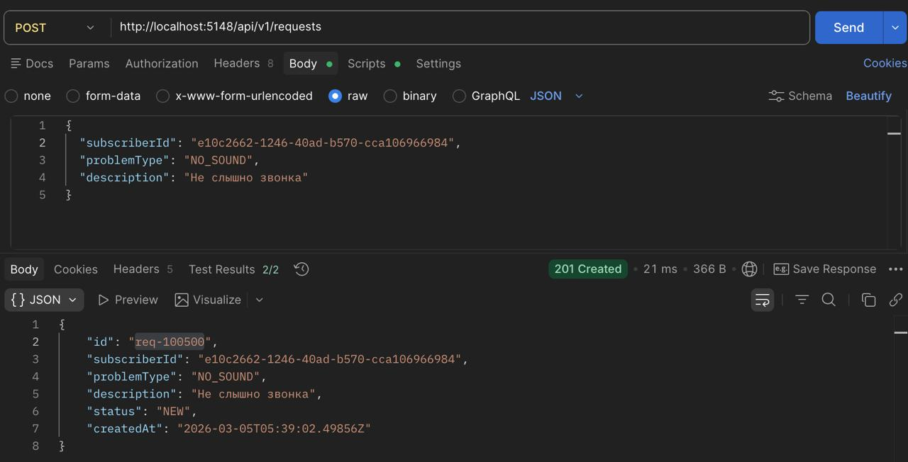
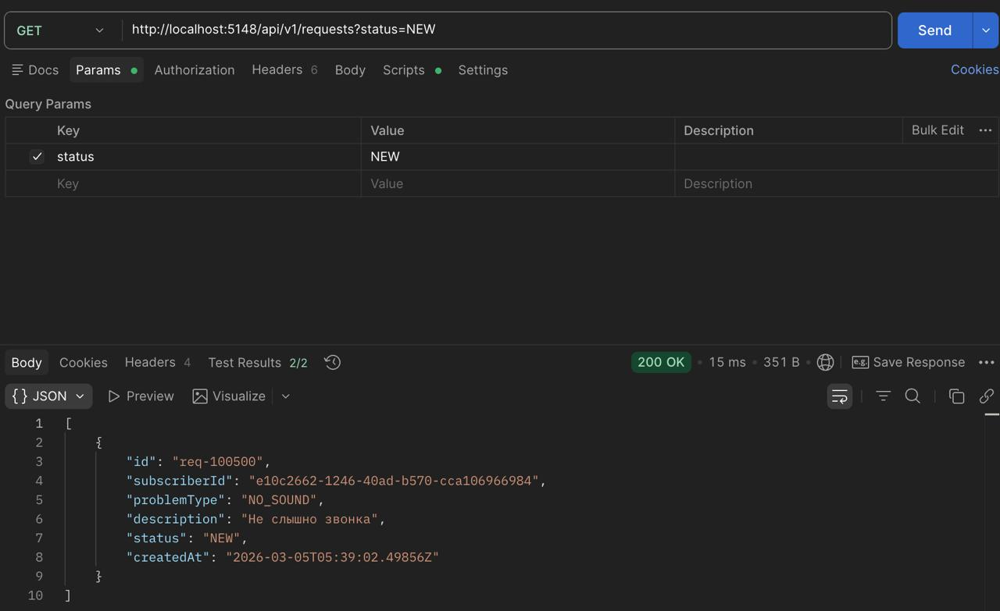
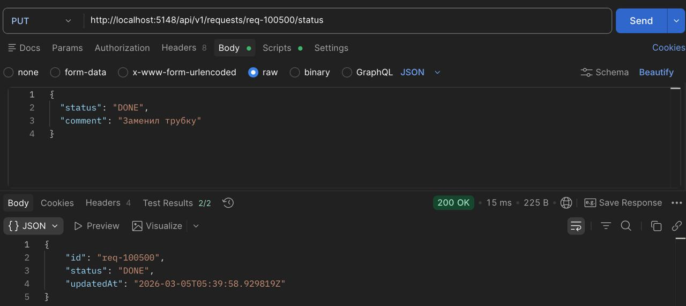
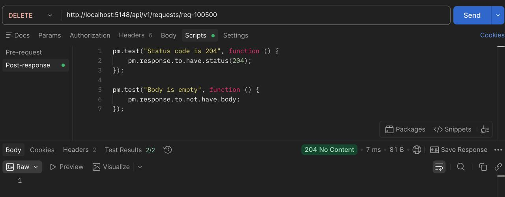

# Лабораторная работа №4

**Тема:** Проектирование REST API  
**Цель работы:** Получить опыт проектирования программного интерфейса.

## Документация по API

В рамках лабораторной работы спроектирован REST API для CRM-системы домофонной компании. Основные сущности: Абоненты (Subscribers) и Заявки на ремонт (Requests).

### 1. Абоненты (Subscribers)

#### 1.1. Получить список абонентов (Поиск)

**`GET /api/v1/subscribers`**

**Описание:**
Возвращает список абонентов с возможностью фильтрации по поисковому запросу (ФИО, адрес, телефон). Используется менеджером для быстрого поиска клиента при звонке.

**Параметры запроса (Query Params):**
- `query` (string, optional) — строка поиска (часть ФИО, адреса или телефона)
- `limit` (integer, optional) — количество записей (по умолчанию 20)

**Ответ 200 OK**

- **Тип:** JSON Array
- **Описание:** Список найденных абонентов с краткими данными (баланс, статус)

**Пример ответа:**
```json
[
  {
    "id": "a1b2c3d4-e5f6-7890-1234-56789abcdef0",
    "fullName": "Иванов Иван Иванович",
    "address": "ул. Ленина, д. 45, кв. 12",
    "phoneNumber": "+79001234567",
    "balance": -150.00,
    "isActive": true
  },
  {
    "id": "b2c3d4e5-f6a7-8901-2345-67890bcdef12",
    "fullName": "Петров Петр Петрович",
    "address": "ул. Ленина, д. 45, кв. 15",
    "phoneNumber": "+79007654321",
    "balance": 250.00,
    "isActive": true
  }
]
```

#### 1.2. Создать нового абонента

**`POST /api/v1/subscribers`**

**Описание:**
Регистрирует нового абонента в системе.

**Тело запроса (JSON):**
```json
{
  "fullName": "Сидоров Сидор Сидорович",
  "street": "ул. Гагарина",
  "house": "10",
  "apartment": "5",
  "phoneNumber": "+79998887766",
  "tariffId": 1
}
```

**Ответ 201 Created**

- **Тип:** JSON
- **Описание:** Возвращает ID созданного абонента.

**Пример ответа:**
```json
{
  "id": "c3d4e5f6-a7b8-9012-3456-78901cdef234",
  "message": "Subscriber created successfully"
}
```

#### 1.3. Обновить данные абонента

**`PUT /api/v1/subscribers/{id}`**

**Описание:**
Полное обновление данных абонента (например, смена фамилии или телефона).

**Параметры пути:**
- `id` (UUID) — идентификатор абонента

**Тело запроса (JSON):**
```json
{
  "fullName": "Сидорова Анна Ивановна",
  "phoneNumber": "+79991112233",
  "isActive": false
}
```

**Ответ 200 OK**
```json
{
  "id": "c3d4e5f6-a7b8-9012-3456-78901cdef234",
  "updatedAt": "2023-10-27T10:00:00Z"
}
```

#### 1.4. Удалить абонента

**`DELETE /api/v1/subscribers/{id}`**

**Описание:**
Архивирует или удаляет абонента из системы.

**Ответ 204 No Content**

---

### 2. Заявки на ремонт (Requests)

#### 2.1. Создать заявку

**`POST /api/v1/requests`**

**Описание:**
Менеджер регистрирует новую заявку на ремонт для конкретного абонента.

**Тело запроса (JSON):**
```json
{
  "subscriberId": "a1b2c3d4-e5f6-7890-1234-56789abcdef0",
  "problemType": "NO_SOUND",
  "description": "Не слышно звонка в трубке",
  "preferredTime": "10:00-12:00"
}
```

**Ответ 201 Created**
```json
{
  "id": "req-100500",
  "status": "NEW",
  "createdAt": "2023-10-27T09:30:00Z"
}
```

#### 2.2. Получить список заявок (для Мастера)

**`GET /api/v1/requests`**

**Описание:**
Возвращает список активных заявок. Мастер может фильтровать их по статусу.

**Параметры запроса:**
- `status` (string, optional) — фильтр (NEW, IN_PROGRESS, DONE)
- `masterId` (UUID, optional) — фильтр по назначенному мастеру

**Пример ответа:**
```json
[
  {
    "id": "req-100500",
    "address": "ул. Ленина, д. 45, кв. 12",
    "problem": "Не слышно звонка",
    "status": "NEW",
    "priority": "HIGH"
  }
]
```

#### 2.3. Изменить статус заявки

**`PUT /api/v1/requests/{id}/status`**

**Описание:**
Мастер меняет статус заявки (например, берет в работу или закрывает).

**Тело запроса:**
```json
{
  "status": "DONE",
  "comment": "Заменил трубку, все работает"
}
```

**Ответ 200 OK**
```json
{
  "id": "req-100500",
  "status": "DONE",
  "updatedAt": "2023-10-27T12:00:00Z"
}
```

#### 2.4. Удалить заявку

**`DELETE /api/v1/requests/{id}`**

**Описание:**
Отмена ошибочно созданной заявки.

**Ответ 204 No Content**

---

## Тестирование API

### 1. Тесты для Абонентов

#### 1.1. GET /api/v1/subscribers (Поиск)



**Код автотеста (Postman Tests):**
```javascript
pm.test("Status code is 200", function () {
    pm.response.to.have.status(200);
});

pm.test("Response is an array", function () {
    var jsonData = pm.response.json();
    pm.expect(jsonData).to.be.an("array");
});
```

#### 1.2. POST /api/v1/subscribers (Создание)



**Код автотеста:**
```javascript
pm.test("Status code is 201", function () {
    pm.response.to.have.status(201);
});

pm.test("Returns ID", function () {
    var jsonData = pm.response.json();
    pm.expect(jsonData).to.have.property("id");
});
```

#### 1.3. PUT /api/v1/subscribers/{id} (Обновление)



**Код автотеста:**
```javascript
pm.test("Status code is 200", function () {
    pm.response.to.have.status(200);
});

pm.test("Response has updatedAt timestamp", function () {
    var jsonData = pm.response.json();
    pm.expect(jsonData).to.have.property("updatedAt");
});
```

#### 1.4. DELETE /api/v1/subscribers/{id} (Удаление)



**Код автотеста:**
```javascript
pm.test("Status code is 204", function () {
    pm.response.to.have.status(204);
});

pm.test("Body is empty", function () {
    pm.response.to.not.have.body;
});
```

### 2. Тесты для Заявок

#### 2.1. POST /api/v1/requests (Создание)



**Код автотеста:**
```javascript
pm.test("Status code is 201", function () {
    pm.response.to.have.status(201);
});

pm.test("Status is NEW", function () {
    var jsonData = pm.response.json();
    pm.expect(jsonData.status).to.eql("NEW");
});
```

#### 2.2. GET /api/v1/requests (Список)



**Код автотеста:**
```javascript
pm.test("Status code is 200", function () {
    pm.response.to.have.status(200);
});

pm.test("Response is an array", function () {
    var jsonData = pm.response.json();
    pm.expect(jsonData).to.be.an("array");
});
```

#### 2.3. PUT /api/v1/requests/{id}/status (Смена статуса)



**Код автотеста:**
```javascript
pm.test("Status code is 200", function () {
    pm.response.to.have.status(200);
});

pm.test("Status updated to DONE", function () {
    var jsonData = pm.response.json();
    pm.expect(jsonData.status).to.eql("DONE");
});
```

#### 2.4. DELETE /api/v1/requests/{id} (Удаление)



**Код автотеста:**
```javascript
pm.test("Status code is 204", function () {
    pm.response.to.have.status(204);
});

pm.test("Body is empty", function () {
    pm.response.to.not.have.body;
});
```